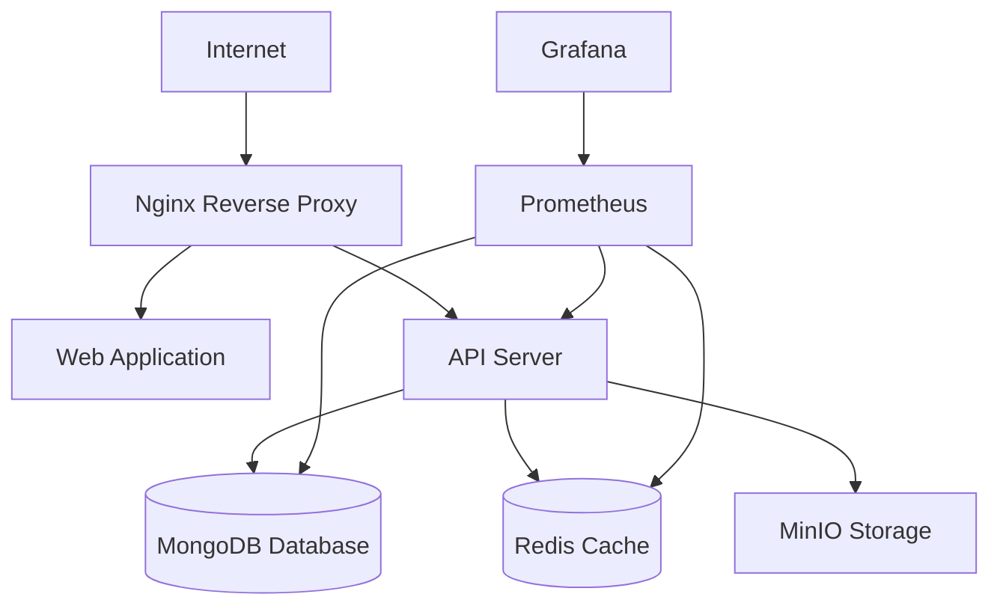

# SimplePro-v3 Production Deployment Guide

This document provides comprehensive instructions for deploying SimplePro-v3 to production environments.

## Table of Contents

1. [Prerequisites](#prerequisites)
2. [Infrastructure Overview](#infrastructure-overview)
3. [Security Configuration](#security-configuration)
4. [Environment Setup](#environment-setup)
5. [Deployment Process](#deployment-process)
6. [Monitoring and Observability](#monitoring-and-observability)
7. [Backup and Disaster Recovery](#backup-and-disaster-recovery)
8. [Maintenance and Operations](#maintenance-and-operations)
9. [Troubleshooting](#troubleshooting)

## Prerequisites

### System Requirements

- **Operating System**: Linux (Ubuntu 20.04+ recommended) or macOS
- **Memory**: Minimum 4GB RAM (8GB+ recommended for production)
- **Storage**: Minimum 20GB free disk space (50GB+ recommended)
- **Network**: Stable internet connection for pulling Docker images

### Required Software

- **Docker**: Version 24.0+ with Docker Compose
- **Node.js**: Version 20.0+ with npm 10.0+
- **Git**: For CI/CD and version control
- **curl**: For health checks and API testing

### Validate Prerequisites

Run the environment validation script:

```bash
./scripts/validate-environment.sh
```

This will check all prerequisites and provide a detailed report.

## Infrastructure Overview

### Architecture Components

SimplePro-v3 uses a microservices architecture deployed with Docker Compose:

- **Web Application** (Next.js): Frontend dashboard on port 3000
- **API Server** (NestJS): Backend API on port 4000
- **Database** (MongoDB 7.0): Primary data storage on port 27017
- **Cache** (Redis 7): Session and application cache on port 6379
- **Reverse Proxy** (Nginx): SSL termination and load balancing on ports 80/443
- **File Storage** (MinIO): S3-compatible object storage on ports 9000/9001
- **Monitoring** (Prometheus + Grafana): Metrics and dashboards on ports 9090/3001

### Network Architecture



### Security Features

- **SSL/TLS encryption** for all external communications
- **JWT-based authentication** with refresh tokens
- **Role-based access control (RBAC)** for authorization
- **Secrets management** with encrypted storage
- **Security headers** and CORS policies
- **Rate limiting** and DDoS protection
- **Container security** with non-root users

## Security Configuration

### 1. SSL/TLS Certificates

For production, use certificates from a trusted CA:

```bash
# Generate self-signed certificates for development/testing
./docker/ssl/generate-certs.sh

# For production with Let's Encrypt
sudo certbot --nginx -d yourdomain.com
```

### 2. Secrets Management

Set up production secrets:

```bash
# Initialize secrets management
./scripts/secrets-management.sh setup

# Validate existing secrets
./scripts/secrets-management.sh validate

# Rotate secrets (periodic security update)
./scripts/secrets-management.sh rotate
```

### 3. Environment Variables

Key security-related environment variables:

```bash
# JWT Configuration
JWT_SECRET=your-64-character-hex-secret
JWT_REFRESH_SECRET=your-64-character-hex-refresh-secret
JWT_EXPIRES_IN=1h
JWT_REFRESH_EXPIRES_IN=7d

# Database Security
MONGODB_USERNAME=admin
MONGODB_PASSWORD=your-secure-password

# Redis Security
REDIS_PASSWORD=your-redis-password

# CORS Security
CORS_ORIGIN=https://yourdomain.com
CORS_CREDENTIALS=true
```

## Environment Setup

### 1. Clone Repository

```bash
git clone https://github.com/your-org/simplepro-v3.git
cd simplepro-v3
```

### 2. Install Dependencies

```bash
npm install
```

### 3. Environment Configuration

```bash
# Copy example environment file
cp .env.example .env.production

# Edit production configuration
nano .env.production
```

### 4. Build Applications

```bash
npm run build
```

## Deployment Process

### Automated Deployment

Use the comprehensive deployment script:

```bash
# Run full production deployment
./scripts/deploy-prod.sh

# Deploy with custom settings
HEALTH_CHECK_TIMEOUT=600 ./scripts/deploy-prod.sh

# Run only health checks
./scripts/deploy-prod.sh health
```

### Manual Deployment Steps

If you prefer manual deployment:

```bash
# 1. Validate environment
./scripts/validate-environment.sh

# 2. Setup secrets and SSL
./scripts/secrets-management.sh setup
./docker/ssl/generate-certs.sh

# 3. Build and deploy
npm run build
docker-compose -f docker-compose.prod.yml up -d --build

# 4. Verify deployment
docker-compose -f docker-compose.prod.yml ps
curl -k https://localhost/api/health
```

### Deployment Verification

After deployment, verify all services:

- **Web Application**: https://localhost
- **API Health**: https://localhost/api/health
- **Grafana Dashboard**: http://localhost:3001
- **Prometheus Metrics**: http://localhost:9090
- **MinIO Console**: http://localhost:9001

## Monitoring and Observability

### Prometheus Metrics

The system exports comprehensive metrics:

- **Application metrics**: Request rates, response times, error rates
- **System metrics**: CPU, memory, disk usage
- **Database metrics**: MongoDB connections, query performance
- **Cache metrics**: Redis memory usage, hit rates

### Grafana Dashboards

Pre-configured dashboards include:

- **System Overview**: High-level health and performance
- **Application Performance**: API metrics and user activity
- **Infrastructure**: Database and cache performance
- **Security**: Authentication failures and rate limiting

### Alerting Rules

Prometheus alerting rules monitor:

- Service availability and health checks
- High error rates or response times
- Resource utilization thresholds
- Security events and anomalies

### Log Management

Centralized logging with structured formats:

```bash
# View all service logs
docker-compose -f docker-compose.prod.yml logs -f

# View specific service logs
docker-compose -f docker-compose.prod.yml logs -f api
docker-compose -f docker-compose.prod.yml logs -f web
```

## Backup and Disaster Recovery

### Automated Backup System

The backup system provides comprehensive data protection:

```bash
# Create full system backup
./scripts/backup-restore.sh backup

# Create MongoDB-only backup
./scripts/backup-restore.sh mongodb

# Clean old backups (>30 days)
./scripts/backup-restore.sh cleanup
```

### Backup Components

- **MongoDB database**: Complete data dump with compression
- **Redis cache**: Snapshot and AOF files
- **Application logs**: Docker and application logs
- **Configuration files**: Docker configs and environment files
- **Docker volumes**: Persistent data volumes

### Disaster Recovery Procedures

```bash
# Restore MongoDB from backup
./scripts/backup-restore.sh restore-mongodb /path/to/backup.archive

# Restore Redis from backup
./scripts/backup-restore.sh restore-redis /path/to/dump.rdb

# Full system health check
./scripts/backup-restore.sh health
```

### Backup Schedule

Recommended backup schedule:

- **Daily**: Full system backup at 2 AM
- **Hourly**: Database incremental backup during business hours
- **Weekly**: Full volume backup for disaster recovery
- **Monthly**: Long-term archive backup

## Maintenance and Operations

### Regular Maintenance Tasks

1. **Security Updates**: Monthly dependency and security updates
2. **Certificate Renewal**: SSL certificate monitoring and renewal
3. **Log Rotation**: Automated log cleanup and archival
4. **Performance Monitoring**: Regular performance reviews
5. **Backup Verification**: Monthly backup restore testing

### Scaling Considerations

For high-traffic environments:

1. **Horizontal Scaling**: Deploy multiple API instances behind load balancer
2. **Database Scaling**: MongoDB replica sets or sharding
3. **Cache Scaling**: Redis clustering for high availability
4. **CDN Integration**: Static asset delivery optimization

### Performance Optimization

Key optimization areas:

- **Database Indexing**: Optimize MongoDB queries and indexes
- **Caching Strategy**: Implement application-level caching
- **Asset Optimization**: Minify and compress static assets
- **Connection Pooling**: Optimize database connection management

## CI/CD Pipeline

### GitHub Actions Workflow

The project includes comprehensive CI/CD pipelines:

- **Code Quality**: ESLint, Prettier, TypeScript checks
- **Testing**: Unit tests, integration tests, security scans
- **Building**: Multi-architecture Docker images
- **Deployment**: Automated staging and production deployment
- **Monitoring**: Post-deployment health checks and alerting

### Pipeline Stages

1. **Quality Gate**: Code quality and security validation
2. **Testing**: Comprehensive test suite execution
3. **Building**: Docker image creation and optimization
4. **Security Scanning**: Vulnerability assessment
5. **Deployment**: Environment-specific deployment
6. **Verification**: Health checks and smoke tests

## Troubleshooting

### Common Issues

#### Service Health Check Failures

```bash
# Check service status
docker-compose -f docker-compose.prod.yml ps

# View service logs
docker-compose -f docker-compose.prod.yml logs service-name

# Restart specific service
docker-compose -f docker-compose.prod.yml restart service-name
```

#### Database Connection Issues

```bash
# Check MongoDB connectivity
docker exec simplepro-mongodb-prod mongosh --eval "db.adminCommand('ping')"

# Check Redis connectivity
docker exec simplepro-redis-prod redis-cli ping

# Review database logs
docker-compose -f docker-compose.prod.yml logs mongodb redis
```

#### SSL Certificate Issues

```bash
# Check certificate validity
openssl x509 -in docker/ssl/cert.pem -text -noout

# Test SSL connection
openssl s_client -connect localhost:443 -servername localhost

# Regenerate certificates
./docker/ssl/generate-certs.sh
```

### Performance Issues

#### High Memory Usage

```bash
# Check container resource usage
docker stats

# Optimize memory limits in docker-compose.prod.yml
# Restart services with new limits
docker-compose -f docker-compose.prod.yml up -d
```

#### Slow Database Queries

```bash
# Enable MongoDB profiling
docker exec simplepro-mongodb-prod mongosh --eval "db.setProfilingLevel(2)"

# Review slow queries
docker exec simplepro-mongodb-prod mongosh --eval "db.system.profile.find().limit(5).sort({ts:-1}).pretty()"
```

### Getting Help

For additional support:

1. **Documentation**: Check the `/docs` directory for detailed guides
2. **Logs**: Review application and system logs for error details
3. **Monitoring**: Use Grafana dashboards to identify performance issues
4. **Health Checks**: Run validation scripts to diagnose problems

## Security Considerations

### Production Security Checklist

- [ ] SSL/TLS certificates from trusted CA
- [ ] Strong passwords and JWT secrets
- [ ] Firewall rules configured
- [ ] Regular security updates
- [ ] Backup encryption enabled
- [ ] Access logging configured
- [ ] Rate limiting enabled
- [ ] Security headers configured

### Compliance Requirements

SimplePro-v3 supports compliance with:

- **SOC 2**: Security and availability controls
- **GDPR**: Data protection and privacy
- **HIPAA**: Healthcare data security (if applicable)
- **PCI DSS**: Payment card data security (if applicable)

## Conclusion

This deployment guide provides a comprehensive foundation for production deployment of SimplePro-v3. Regular monitoring, maintenance, and security updates are essential for optimal performance and security.

For the latest updates and additional documentation, refer to the project repository and changelog.