# SimplePro-v3 Architecture

## System Overview

SimplePro-v3 is a single-tenant internal moving company management system designed to streamline sales, estimates, and operations through deterministic processes and mobile-first design.

## High-Level Architecture

```mermaid
graph TB
    subgraph "Client Layer"
        WEB[Web Dashboard<br/>Next.js]
        MOBILE[Crew Mobile App<br/>React Native]
        ADMIN[Admin Interface<br/>Next.js]
    end

    subgraph "API Gateway & Security"
        GATEWAY[API Gateway<br/>NestJS]
        AUTH[SSO + RBAC<br/>OAuth2/SAML]
        RATE[Rate Limiting<br/>Throttler]
    end

    subgraph "Core Services"
        CRM[CRM Service<br/>Customer Management]
        EST[Estimate Service<br/>Deterministic Calculator]
        OPS[Operations Service<br/>Dispatch & Scheduling]
        CREW[Crew Service<br/>Availability & Tasks]
        NOTIFY[Notification Service<br/>Email/SMS]
        AUDIT[Audit Service<br/>Activity Tracking]
    end

    subgraph "Data Layer"
        MONGO[(MongoDB<br/>Primary Database)]
        REDIS[(Redis<br/>Cache & Sessions)]
        S3[(MinIO/S3<br/>File Storage)]
        SEARCH[(Search Index<br/>Optional)]
    end

    subgraph "External Integrations"
        EMAIL[Email Provider<br/>SMTP/SES]
        SMS[SMS Provider<br/>Twilio]
        PAYMENT[Payment Gateway<br/>Stripe]
        PARTNERS[Partner APIs<br/>Lead Sources]
    end

    subgraph "Infrastructure"
        MONITOR[Monitoring<br/>Prometheus/Grafana]
        LOGS[Centralized Logging<br/>ELK Stack]
        BACKUP[Backup & DR<br/>Automated Snapshots]
        SECURITY[Security<br/>Encryption at Rest]
    end

    %% Client Connections
    WEB --> GATEWAY
    MOBILE --> GATEWAY
    ADMIN --> GATEWAY

    %% Security Layer
    GATEWAY --> AUTH
    GATEWAY --> RATE

    %% Service Connections
    GATEWAY --> CRM
    GATEWAY --> EST
    GATEWAY --> OPS
    GATEWAY --> CREW
    GATEWAY --> NOTIFY
    GATEWAY --> AUDIT

    %% Database Connections
    CRM --> MONGO
    EST --> MONGO
    OPS --> MONGO
    CREW --> MONGO
    AUDIT --> MONGO

    %% Cache Connections
    CRM --> REDIS
    EST --> REDIS
    AUTH --> REDIS

    %% File Storage
    CRM --> S3
    OPS --> S3
    CREW --> S3

    %% External Services
    NOTIFY --> EMAIL
    NOTIFY --> SMS
    CRM --> PAYMENT
    CRM --> PARTNERS

    %% Monitoring
    GATEWAY --> MONITOR
    CRM --> LOGS
    EST --> LOGS
    OPS --> LOGS
    CREW --> LOGS

    style WEB fill:#e1f5fe
    style MOBILE fill:#e1f5fe
    style ADMIN fill:#e1f5fe
    style GATEWAY fill:#fff3e0
    style MONGO fill:#e8f5e8
    style REDIS fill:#ffe0e0
    style S3 fill:#f3e5f5
```



## Component Architecture

### 1. Web Dashboard (Next.js)
- **Purpose**: Primary interface for sales, management, and operations
- **Features**:
  - Customer management and CRM
  - Estimate creation and approval
  - Dispatch calendar and resource assignment
  - Real-time job status monitoring
  - Analytics and reporting
- **Technology**: Next.js 14, TypeScript, Tailwind CSS, React Query
- **Security**: SSO integration, role-based access control

### 2. Mobile Crew App (React Native)
- **Purpose**: Field operations and crew management
- **Features**:
  - Offline-first architecture
  - Digital signatures and photo capture
  - Availability management
  - Task checklists and completion
  - Real-time status updates
- **Technology**: React Native, Expo, SQLite (offline), TypeScript
- **Sync**: Background synchronization when online

### 3. Admin Interface (Next.js)
- **Purpose**: System administration and configuration
- **Features**:
  - Rules engine configuration
  - User management and RBAC
  - System monitoring and health
  - Audit log review
  - Backup/restore operations
- **Technology**: Next.js, TypeScript, specialized admin components
- **Access**: Admin-only with enhanced security

### 4. API Gateway (NestJS)
- **Purpose**: Centralized API management and security
- **Features**:
  - Authentication and authorization
  - Rate limiting and throttling
  - Request/response validation
  - API versioning
  - GraphQL and REST endpoints
- **Technology**: NestJS, Passport, JWT, GraphQL, Swagger
- **Performance**: Response caching, query optimization

### 5. Core Business Services

#### CRM Service
- Customer lifecycle management
- Lead tracking and conversion
- Automated follow-ups and templates
- Partner lead ingestion
- Activity audit trail

#### Estimate Service
- **Deterministic Calculator**: Room-by-room inventory analysis
- **Rules Engine**: Configurable pricing and adjustment rules
- **Location Handicaps**: Geographic and access modifiers
- **Seeded Evaluator**: Consistent estimate generation
- **Audit Trail**: Complete estimate history and changes

#### Operations Service
- Dispatch calendar management
- Drag-and-drop resource assignment
- Job scheduling and optimization
- Real-time status tracking
- Payroll calculation integration

#### Crew Service
- Crew availability management
- Task assignment and tracking
- Mobile app synchronization
- Performance metrics
- Certification tracking

### 6. Data Architecture

#### MongoDB (Primary Database)
```javascript
// Collections Structure
{
  customers: "Customer records and history",
  estimates: "Estimate data and calculations",
  jobs: "Active and completed jobs",
  crews: "Crew information and availability",
  inventory: "Room-by-room item catalogs",
  rules: "Business rules and pricing",
  audits: "Complete activity audit trail",
  users: "User accounts and permissions"
}
```

#### Redis (Cache & Sessions)
- User sessions and JWT tokens
- Frequently accessed estimates and jobs
- Real-time data for dashboard updates
- Rate limiting counters
- Background job queues

#### MinIO/S3 (File Storage)
- Customer photos and signatures
- Job documentation and receipts
- Estimate attachments
- Crew selfies and job photos
- System backups and exports

## Security Architecture

### Authentication & Authorization
- **SSO Integration**: SAML/OAuth2 with corporate identity provider
- **RBAC**: Role-based access control with granular permissions
- **JWT Tokens**: Stateless authentication with refresh tokens
- **Session Management**: Redis-based session storage

### Data Protection
- **Encryption at Rest**: MongoDB and file storage encryption
- **Encryption in Transit**: TLS 1.3 for all communications
- **PII Masking**: Automatic masking of sensitive customer data
- **Audit Logging**: Complete activity trail with tamper protection

### Network Security
- **Internal-Only Deployment**: No public internet access
- **Network Segmentation**: Isolated service communications
- **Rate Limiting**: Per-user and per-endpoint throttling
- **Input Validation**: Comprehensive request validation

## Integration Architecture

### External Services
- **Email Provider**: Automated notifications and follow-ups
- **SMS Gateway**: Real-time alerts and confirmations
- **Payment Gateway**: Secure payment processing
- **Partner APIs**: Lead source integrations

### Mock Integrations
- **Configurable Mocks**: Development and testing environments
- **Partner Simulation**: Realistic data for testing
- **Payment Simulation**: Safe payment flow testing

## Deployment Architecture

### Development Environment
```yaml
# docker-compose.dev.yml
services:
  - MongoDB (primary database)
  - Redis (cache and sessions)
  - MinIO (S3-compatible storage)
  - MailHog (email testing)
  - API (NestJS backend)
  - Web (Next.js frontend)
  - Mobile (Expo development server)
```

### Production Environment
- **Container Orchestration**: Docker Compose or Kubernetes
- **Load Balancing**: NGINX or cloud load balancer
- **SSL Termination**: Automated certificate management
- **Database Clustering**: MongoDB replica sets
- **Cache Clustering**: Redis cluster setup

## Observability & Monitoring

### Metrics & Monitoring
- **Application Metrics**: Custom business metrics
- **Infrastructure Metrics**: System health and performance
- **User Analytics**: Feature usage and adoption
- **Error Tracking**: Real-time error reporting

### Logging & Auditing
- **Structured Logging**: JSON-formatted application logs
- **Audit Trail**: Immutable record of all user actions
- **Performance Logging**: Request/response timing
- **Security Logging**: Authentication and authorization events

### Backup & Disaster Recovery
- **Automated Backups**: Daily database and file backups
- **Point-in-Time Recovery**: Transaction log backups
- **Cross-Region Replication**: Optional for high availability
- **Recovery Testing**: Regular restore validation

## Compliance & Legal

### E-Signature Compliance
- **ESIGN Act Compliance**: Legal electronic signatures
- **UETA Compliance**: Uniform Electronic Transactions Act
- **Audit Trail**: Complete signature history
- **Authentication**: Multi-factor signature verification

### Data Governance
- **Data Retention**: Configurable retention policies
- **Data Purging**: Automated cleanup of expired data
- **Export Capabilities**: Customer data portability
- **Privacy Controls**: Data access and modification tracking

## Scalability Considerations

### Performance Optimization
- **Database Indexing**: Optimized query performance
- **Caching Strategy**: Multi-layer caching approach
- **Lazy Loading**: On-demand data loading
- **Connection Pooling**: Efficient database connections

### Horizontal Scaling
- **Service Isolation**: Microservices architecture
- **Database Sharding**: Optional for large datasets
- **CDN Integration**: Static asset optimization
- **Auto-scaling**: Container-based scaling