# SimplePro-v3 Database Design (ERD)

## Entity Relationship Diagram

```mermaid
erDiagram
    %% Core Entities
    User {
        ObjectId _id PK
        string email UK
        string firstName
        string lastName
        string phoneNumber
        string role
        boolean isActive
        ObjectId[] permissions FK
        Date lastLogin
        Date createdAt
        Date updatedAt
    }

    Customer {
        ObjectId _id PK
        string firstName
        string lastName
        string email UK
        string phoneNumber
        Address currentAddress
        Address destinationAddress
        string status
        string leadSource
        Date preferredMoveDate
        string notes
        ObjectId assignedSalesperson FK
        Date createdAt
        Date updatedAt
    }

    Estimate {
        ObjectId _id PK
        string estimateNumber UK
        ObjectId customerId FK
        ObjectId createdBy FK
        string status
        Address pickupAddress
        Address deliveryAddress
        Date estimatedMoveDate
        number totalWeight
        number totalVolume
        number laborHours
        number basePrice
        number adjustments
        number locationHandicap
        number finalPrice
        ObjectId[] inventoryRooms FK
        ObjectId[] appliedRules FK
        string notes
        Date expiresAt
        Date approvedAt
        ObjectId approvedBy FK
        Date createdAt
        Date updatedAt
    }

    Job {
        ObjectId _id PK
        string jobNumber UK
        ObjectId estimateId FK
        ObjectId customerId FK
        string status
        Date scheduledDate
        Date actualStartDate
        Date actualEndDate
        ObjectId[] assignedCrews FK
        Address pickupAddress
        Address deliveryAddress
        number actualWeight
        number actualHours
        number actualPrice
        string notes
        ObjectId[] documents FK
        PayrollCalculation payroll
        Date createdAt
        Date updatedAt
    }

    Crew {
        ObjectId _id PK
        string name
        ObjectId[] members FK
        string status
        boolean isActive
        number capacity
        string[] specialties
        Equipment[] equipment
        Availability[] availability
        Date createdAt
        Date updatedAt
    }

    CrewMember {
        ObjectId _id PK
        string firstName
        string lastName
        string email
        string phoneNumber
        string role
        number payRate
        string[] certifications
        boolean isActive
        ObjectId[] crewIds FK
        EmergencyContact emergencyContact
        Date hireDate
        Date createdAt
        Date updatedAt
    }

    InventoryRoom {
        ObjectId _id PK
        ObjectId estimateId FK
        string roomType
        string description
        InventoryItem[] items
        number totalWeight
        number totalVolume
        Date createdAt
        Date updatedAt
    }

    InventoryItem {
        ObjectId _id PK
        string name
        string category
        number weight
        number volume
        number quantity
        string condition
        boolean fragile
        boolean valuable
        number estimatedValue
        string description
        string[] photos
        Date createdAt
        Date updatedAt
    }

    PricingRule {
        ObjectId _id PK
        string name
        string description
        string type
        RuleCondition[] conditions
        RuleAction[] actions
        number priority
        boolean isActive
        string applicableServices
        Date effectiveFrom
        Date effectiveTo
        ObjectId createdBy FK
        Date createdAt
        Date updatedAt
    }

    AuditLog {
        ObjectId _id PK
        string action
        string entityType
        ObjectId entityId
        ObjectId userId FK
        object originalData
        object newData
        string ipAddress
        string userAgent
        Date timestamp
    }

    Document {
        ObjectId _id PK
        string filename
        string originalName
        string mimeType
        number size
        string s3Key
        string documentType
        ObjectId relatedEntityId
        string relatedEntityType
        ObjectId uploadedBy FK
        boolean isPublic
        Date expiresAt
        Date createdAt
        Date updatedAt
    }

    Payment {
        ObjectId _id PK
        ObjectId jobId FK
        string paymentMethod
        number amount
        string currency
        string status
        string stripePaymentId
        string description
        Date paidAt
        ObjectId processedBy FK
        Date createdAt
        Date updatedAt
    }

    Review {
        ObjectId _id PK
        ObjectId customerId FK
        ObjectId jobId FK
        number rating
        string title
        string comment
        string source
        boolean isPublic
        Date reviewDate
        ObjectId respondedBy FK
        string response
        Date responseDate
        Date createdAt
        Date updatedAt
    }

    Notification {
        ObjectId _id PK
        ObjectId userId FK
        string type
        string title
        string message
        object data
        boolean isRead
        string channel
        Date scheduledFor
        Date sentAt
        string status
        Date createdAt
        Date updatedAt
    }

    %% Relationships
    Customer ||--o{ Estimate : "has estimates"
    Estimate ||--o| Job : "converts to job"
    Job ||--o{ Payment : "has payments"
    Job }o--o{ Crew : "assigned crews"
    Crew ||--o{ CrewMember : "has members"
    Estimate ||--o{ InventoryRoom : "contains rooms"
    InventoryRoom ||--o{ InventoryItem : "contains items"
    Estimate }o--o{ PricingRule : "applies rules"
    User ||--o{ Customer : "manages"
    User ||--o{ Estimate : "creates"
    User ||--o{ Job : "manages"
    User ||--o{ AuditLog : "performs actions"
    Customer ||--o{ Review : "writes reviews"
    Job ||--o{ Document : "has documents"
    User ||--o{ Document : "uploads"
    User ||--o{ Notification : "receives"
    Job ||--o{ Review : "gets reviewed"
```



## Schema Definitions

### Core Business Objects

#### Customer Schema

```javascript
{
  _id: ObjectId,
  firstName: { type: String, required: true, trim: true },
  lastName: { type: String, required: true, trim: true },
  email: { type: String, required: true, unique: true, lowercase: true },
  phoneNumber: { type: String, required: true },
  currentAddress: {
    street: String,
    city: String,
    state: String,
    zipCode: String,
    country: { type: String, default: 'USA' },
    coordinates: {
      lat: Number,
      lng: Number
    }
  },
  destinationAddress: {
    street: String,
    city: String,
    state: String,
    zipCode: String,
    country: { type: String, default: 'USA' },
    coordinates: {
      lat: Number,
      lng: Number
    }
  },
  status: {
    type: String,
    enum: ['lead', 'contacted', 'estimate_requested', 'estimate_sent',
           'estimate_approved', 'scheduled', 'completed', 'cancelled'],
    default: 'lead'
  },
  leadSource: {
    type: String,
    enum: ['website', 'referral', 'google', 'social', 'partner', 'repeat']
  },
  preferredMoveDate: Date,
  notes: String,
  assignedSalesperson: { type: ObjectId, ref: 'User' },
  createdAt: { type: Date, default: Date.now },
  updatedAt: { type: Date, default: Date.now }
}
```

#### Estimate Schema

```javascript
{
  _id: ObjectId,
  estimateNumber: { type: String, unique: true, required: true },
  customerId: { type: ObjectId, ref: 'Customer', required: true },
  createdBy: { type: ObjectId, ref: 'User', required: true },
  status: {
    type: String,
    enum: ['draft', 'sent', 'viewed', 'approved', 'rejected', 'expired'],
    default: 'draft'
  },
  pickupAddress: {
    street: { type: String, required: true },
    city: { type: String, required: true },
    state: { type: String, required: true },
    zipCode: { type: String, required: true },
    country: { type: String, default: 'USA' },
    coordinates: { lat: Number, lng: Number },
    accessDifficulty: {
      type: String,
      enum: ['easy', 'moderate', 'difficult', 'extreme']
    },
    floorLevel: Number,
    elevatorAccess: Boolean,
    longCarry: Boolean,
    parkingDistance: Number
  },
  deliveryAddress: {
    // Same structure as pickupAddress
  },
  estimatedMoveDate: { type: Date, required: true },

  // Calculated Fields
  totalWeight: { type: Number, default: 0 },
  totalVolume: { type: Number, default: 0 },
  laborHours: { type: Number, default: 0 },

  // Pricing Breakdown
  basePrice: { type: Number, default: 0 },
  adjustments: [{
    type: String,
    description: String,
    amount: Number,
    ruleId: ObjectId
  }],
  locationHandicap: { type: Number, default: 0 },
  finalPrice: { type: Number, default: 0 },

  // Related Data
  inventoryRooms: [{ type: ObjectId, ref: 'InventoryRoom' }],
  appliedRules: [{ type: ObjectId, ref: 'PricingRule' }],

  notes: String,
  expiresAt: { type: Date, required: true },
  approvedAt: Date,
  approvedBy: { type: ObjectId, ref: 'User' },

  // Deterministic Hash
  calculationHash: String, // SHA256 of input parameters

  createdAt: { type: Date, default: Date.now },
  updatedAt: { type: Date, default: Date.now }
}
```

#### Job Schema

```javascript
{
  _id: ObjectId,
  jobNumber: { type: String, unique: true, required: true },
  estimateId: { type: ObjectId, ref: 'Estimate', required: true },
  customerId: { type: ObjectId, ref: 'Customer', required: true },
  status: {
    type: String,
    enum: ['scheduled', 'in_progress', 'completed', 'cancelled', 'on_hold'],
    default: 'scheduled'
  },

  // Scheduling
  scheduledDate: { type: Date, required: true },
  actualStartDate: Date,
  actualEndDate: Date,
  assignedCrews: [{ type: ObjectId, ref: 'Crew' }],

  // Addresses (copied from estimate)
  pickupAddress: Object,
  deliveryAddress: Object,

  // Actual vs Estimated
  actualWeight: Number,
  actualHours: Number,
  actualPrice: Number,

  // Job Details
  notes: String,
  documents: [{ type: ObjectId, ref: 'Document' }],

  // Payroll Calculation
  payroll: {
    totalLaborCost: Number,
    crewPayments: [{
      crewMemberId: ObjectId,
      hours: Number,
      rate: Number,
      amount: Number
    }],
    calculatedAt: Date,
    calculatedBy: ObjectId
  },

  createdAt: { type: Date, default: Date.now },
  updatedAt: { type: Date, default: Date.now }
}
```

#### Crew Schema

```javascript
{
  _id: ObjectId,
  name: { type: String, required: true },
  members: [{ type: ObjectId, ref: 'CrewMember' }],
  status: {
    type: String,
    enum: ['available', 'busy', 'offline', 'maintenance'],
    default: 'available'
  },
  isActive: { type: Boolean, default: true },
  capacity: { type: Number, required: true }, // Max jobs per day
  specialties: [{
    type: String,
    enum: ['residential', 'commercial', 'piano', 'antiques', 'storage']
  }],
  equipment: [{
    name: String,
    type: String,
    condition: String,
    lastMaintenance: Date
  }],
  availability: [{
    date: Date,
    status: {
      type: String,
      enum: ['available', 'busy', 'off']
    },
    jobId: ObjectId
  }],

  createdAt: { type: Date, default: Date.now },
  updatedAt: { type: Date, default: Date.now }
}
```

#### PricingRule Schema

```javascript
{
  _id: ObjectId,
  name: { type: String, required: true },
  description: String,
  type: {
    type: String,
    enum: ['weight_based', 'volume_based', 'distance_based', 'difficulty_based',
           'seasonal', 'promotional', 'location_handicap'],
    required: true
  },

  // Rule Logic
  conditions: [{
    field: String, // e.g., 'totalWeight', 'distance', 'pickupAddress.floorLevel'
    operator: String, // 'gt', 'lt', 'eq', 'in', 'between'
    value: Schema.Types.Mixed
  }],
  actions: [{
    type: String, // 'add_fixed', 'add_percentage', 'multiply', 'set_minimum'
    amount: Number,
    description: String
  }],

  priority: { type: Number, default: 0 }, // Higher = applied later
  isActive: { type: Boolean, default: true },
  applicableServices: [String],

  // Validity
  effectiveFrom: Date,
  effectiveTo: Date,

  // Audit
  createdBy: { type: ObjectId, ref: 'User', required: true },
  createdAt: { type: Date, default: Date.now },
  updatedAt: { type: Date, default: Date.now }
}
```

#### InventoryRoom Schema

```javascript
{
  _id: ObjectId,
  estimateId: { type: ObjectId, ref: 'Estimate', required: true },
  roomType: {
    type: String,
    enum: ['living_room', 'bedroom', 'kitchen', 'dining_room', 'bathroom',
           'office', 'garage', 'basement', 'attic', 'closet', 'storage', 'other'],
    required: true
  },
  description: String,
  items: [{
    itemId: { type: ObjectId, ref: 'InventoryItem' },
    quantity: { type: Number, default: 1 },
    condition: {
      type: String,
      enum: ['excellent', 'good', 'fair', 'poor']
    },
    packingRequired: Boolean,
    specialHandling: Boolean,
    notes: String
  }],

  // Calculated totals
  totalWeight: { type: Number, default: 0 },
  totalVolume: { type: Number, default: 0 },

  createdAt: { type: Date, default: Date.now },
  updatedAt: { type: Date, default: Date.now }
}
```

### Supporting Schemas

#### User Schema (Authentication & Authorization)

```javascript
{
  _id: ObjectId,
  email: { type: String, required: true, unique: true },
  firstName: { type: String, required: true },
  lastName: { type: String, required: true },
  phoneNumber: String,
  role: {
    type: String,
    enum: ['admin', 'manager', 'salesperson', 'dispatcher', 'crew_lead'],
    required: true
  },
  permissions: [{
    resource: String, // 'estimates', 'jobs', 'customers', 'crews', 'rules'
    actions: [String] // 'create', 'read', 'update', 'delete'
  }],
  isActive: { type: Boolean, default: true },
  lastLogin: Date,
  ssoId: String, // External SSO identifier

  createdAt: { type: Date, default: Date.now },
  updatedAt: { type: Date, default: Date.now }
}
```

#### AuditLog Schema

```javascript
{
  _id: ObjectId,
  action: { type: String, required: true },
  entityType: { type: String, required: true },
  entityId: { type: ObjectId, required: true },
  userId: { type: ObjectId, ref: 'User', required: true },
  originalData: Schema.Types.Mixed,
  newData: Schema.Types.Mixed,
  ipAddress: String,
  userAgent: String,
  timestamp: { type: Date, default: Date.now }
}
```

## Indexes for Performance

### Primary Indexes

```javascript
// Customer indexes
Customer.index({ email: 1 }, { unique: true })
Customer.index({ assignedSalesperson: 1, status: 1 })
Customer.index({ createdAt: -1 })

// Estimate indexes
Estimate.index({ estimateNumber: 1 }, { unique: true })
Estimate.index({ customerId: 1, createdAt: -1 })
Estimate.index({ status: 1, expiresAt: 1 })
Estimate.index({ createdBy: 1, createdAt: -1 })

// Job indexes
Job.index({ jobNumber: 1 }, { unique: true })
Job.index({ estimateId: 1 })
Job.index({ customerId: 1 })
Job.index({ status: 1, scheduledDate: 1 })
Job.index({ assignedCrews: 1, scheduledDate: 1 })

// Crew indexes
Crew.index({ status: 1, isActive: 1 })
Crew.index({ 'availability.date': 1, 'availability.status': 1 })

// Audit indexes
AuditLog.index({ entityType: 1, entityId: 1, timestamp: -1 })
AuditLog.index({ userId: 1, timestamp: -1 })
AuditLog.index({ timestamp: -1 })

// Pricing Rule indexes
PricingRule.index({ type: 1, isActive: 1, priority: 1 })
PricingRule.index({ effectiveFrom: 1, effectiveTo: 1, isActive: 1 })
```

## Data Relationships & Constraints

### Business Rules

1. **Customer → Estimate**: One customer can have multiple estimates
2. **Estimate → Job**: One estimate can convert to one job maximum
3. **Job → Crew**: One job can have multiple crews assigned
4. **Crew → CrewMember**: One crew can have multiple members
5. **Estimate → InventoryRoom**: One estimate contains multiple rooms
6. **Room → InventoryItem**: One room contains multiple items
7. **Estimate → PricingRule**: Multiple rules can apply to one estimate

### Data Integrity

1. **Soft Deletes**: Most entities use `isActive` flag instead of deletion
2. **Audit Trail**: All changes tracked in AuditLog collection
3. **Reference Integrity**: Foreign key relationships maintained
4. **Validation**: Schema-level validation for all required fields
5. **Unique Constraints**: Estimate numbers, job numbers, user emails

### Performance Considerations

1. **Compound Indexes**: Multi-field queries optimized
2. **TTL Indexes**: Automatic cleanup of expired data
3. **Aggregation Pipelines**: Complex queries pre-optimized
4. **Caching Strategy**: Frequently accessed data cached in Redis
5. **Connection Pooling**: Database connections efficiently managed
