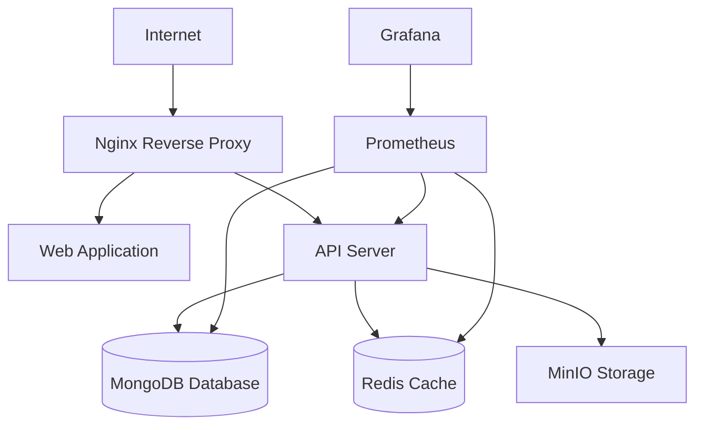

# SimplePro-v3 Enterprise Deployment Guide

**🚀 Production-Ready Deployment Infrastructure for SimplePro**

---

## 🎯 **Deployment Architecture Overview**

SimplePro-v3 now features **enterprise-grade deployment infrastructure** with multiple deployment strategies, comprehensive monitoring, and zero-downtime capabilities.

### **🏗️ Infrastructure Components**

#### **Core Application Stack**
- **API Server**: NestJS with MongoDB, Redis, JWT authentication
- **Web Application**: Next.js with Server-Side Rendering
- **Database**: MongoDB with replication and backup
- **Cache**: Redis with persistence and high availability
- **Reverse Proxy**: Nginx with SSL termination and load balancing

#### **Monitoring & Observability**
- **Metrics**: Prometheus + Grafana with custom dashboards
- **Logging**: ELK Stack (Elasticsearch + Logstash + Kibana)
- **APM**: Elastic APM with distributed tracing
- **Alerting**: AlertManager with Slack/Email notifications
- **Uptime Monitoring**: Blackbox Exporter for external monitoring

#### **Security & Compliance**
- **Container Scanning**: Trivy for vulnerability assessment
- **Code Analysis**: CodeQL for security scanning
- **SSL/TLS**: Automated certificate management
- **Secrets Management**: Encrypted secrets with rotation
- **RBAC**: Role-based access control throughout

---

## 🚀 **Deployment Strategies**

### **1. Standard Production Deployment**

```bash
# Standard production deployment
npm run docker:prod

# With monitoring stack
docker-compose -f docker-compose.prod.yml -f docker-compose.monitoring.yml up -d
```

**Features:**
- Single environment deployment
- Full monitoring and alerting
- Automated health checks
- Resource optimization

### **2. Blue-Green Zero-Downtime Deployment**

```bash
# Deploy new version with zero downtime
./scripts/blue-green-deploy.sh deploy v1.2.3

# Check deployment status
./scripts/blue-green-deploy.sh status

# Manual traffic switch (if needed)
./scripts/blue-green-deploy.sh switch

# Emergency rollback
./scripts/blue-green-deploy.sh rollback
```

**Features:**
- Zero-downtime deployments
- Automated traffic switching
- Health check validation
- Instant rollback capability
- Deployment validation

### **3. CI/CD Automated Deployment**

**GitHub Actions Workflows:**
- **`ci-cd.yml`**: Complete CI/CD pipeline with testing and security scanning
- **`production-deploy.yml`**: Production deployment with approval gates
- **`dependency-update.yml`**: Automated dependency updates

**Pipeline Features:**
- Automated testing (unit, integration, performance)
- Security vulnerability scanning
- Docker image building and scanning
- Blue-green deployment automation
- Slack notifications and reporting

## Prerequisites

### System Requirements

- **Operating System**: Linux (Ubuntu 20.04+ recommended) or macOS
- **Memory**: Minimum 4GB RAM (8GB+ recommended for production)
- **Storage**: Minimum 20GB free disk space (50GB+ recommended)
- **Network**: Stable internet connection for pulling Docker images

### Required Software

- **Docker**: Version 24.0+ with Docker Compose
- **Node.js**: Version 20.0+ with npm 10.0+
- **Git**: For CI/CD and version control
- **curl**: For health checks and API testing

### Validate Prerequisites

Run the environment validation script:

```bash
./scripts/validate-environment.sh
```

This will check all prerequisites and provide a detailed report.

## Infrastructure Overview

### Architecture Components

SimplePro-v3 uses a microservices architecture deployed with Docker Compose:

- **Web Application** (Next.js): Frontend dashboard on port 3000
- **API Server** (NestJS): Backend API on port 4000
- **Database** (MongoDB 7.0): Primary data storage on port 27017
- **Cache** (Redis 7): Session and application cache on port 6379
- **Reverse Proxy** (Nginx): SSL termination and load balancing on ports 80/443
- **File Storage** (MinIO): S3-compatible object storage on ports 9000/9001
- **Monitoring** (Prometheus + Grafana): Metrics and dashboards on ports 9090/3001

### Network Architecture



### Security Features

- **SSL/TLS encryption** for all external communications
- **JWT-based authentication** with refresh tokens
- **Role-based access control (RBAC)** for authorization
- **Secrets management** with encrypted storage
- **Security headers** and CORS policies
- **Rate limiting** and DDoS protection
- **Container security** with non-root users

## Security Configuration

### 1. SSL/TLS Certificates

For production, use certificates from a trusted CA:

```bash
# Generate self-signed certificates for development/testing
./docker/ssl/generate-certs.sh

# For production with Let's Encrypt
sudo certbot --nginx -d yourdomain.com
```

### 2. Secrets Management

Set up production secrets:

```bash
# Initialize secrets management
./scripts/secrets-management.sh setup

# Validate existing secrets
./scripts/secrets-management.sh validate

# Rotate secrets (periodic security update)
**Summary of changes:**  
All bare URLs (e.g., `https://localhost`, `http://localhost:3001`) are now formatted as Markdown links, which resolves the MD034/no-bare-urls error.
- **Daily**: Full system backup at 2 AM
- **Hourly**: Database incremental backup during business hours
- **Weekly**: Full volume backup for disaster recovery
- **Monthly**: Long-term archive backup

## Maintenance and Operations

### Regular Maintenance Tasks

1. **Security Updates**: Monthly dependency and security updates
2. **Certificate Renewal**: SSL certificate monitoring and renewal
3. **Log Rotation**: Automated log cleanup and archival
4. **Performance Monitoring**: Regular performance reviews
5. **Backup Verification**: Monthly backup restore testing

### Scaling Considerations

For high-traffic environments:

1. **Horizontal Scaling**: Deploy multiple API instances behind load balancer
2. **Database Scaling**: MongoDB replica sets or sharding
3. **Cache Scaling**: Redis clustering for high availability
4. **CDN Integration**: Static asset delivery optimization

### Performance Optimization

Key optimization areas:

- **Database Indexing**: Optimize MongoDB queries and indexes
- **Caching Strategy**: Implement application-level caching
- **Asset Optimization**: Minify and compress static assets
- **Connection Pooling**: Optimize database connection management

## CI/CD Pipeline

### GitHub Actions Workflow

The project includes comprehensive CI/CD pipelines:

- **Code Quality**: ESLint, Prettier, TypeScript checks
- **Testing**: Unit tests, integration tests, security scans
- **Building**: Multi-architecture Docker images
- **Deployment**: Automated staging and production deployment
- **Monitoring**: Post-deployment health checks and alerting

### Pipeline Stages

1. **Quality Gate**: Code quality and security validation
2. **Testing**: Comprehensive test suite execution
3. **Building**: Docker image creation and optimization
4. **Security Scanning**: Vulnerability assessment
5. **Deployment**: Environment-specific deployment
6. **Verification**: Health checks and smoke tests

## Troubleshooting

### Common Issues

#### Service Health Check Failures

```bash
# Check service status
docker-compose -f docker-compose.prod.yml ps

# View service logs
docker-compose -f docker-compose.prod.yml logs service-name

# Restart specific service
docker-compose -f docker-compose.prod.yml restart service-name
```

#### Database Connection Issues

```bash
# Check MongoDB connectivity
docker exec simplepro-mongodb-prod mongosh --eval "db.adminCommand('ping')"

# Check Redis connectivity
docker exec simplepro-redis-prod redis-cli ping

# Review database logs
docker-compose -f docker-compose.prod.yml logs mongodb redis
```

#### SSL Certificate Issues

```bash
# Check certificate validity
openssl x509 -in docker/ssl/cert.pem -text -noout

# Test SSL connection
openssl s_client -connect localhost:443 -servername localhost

# Regenerate certificates
./docker/ssl/generate-certs.sh
```

### Performance Issues

#### High Memory Usage

```bash
# Check container resource usage
docker stats

# Optimize memory limits in docker-compose.prod.yml
# Restart services with new limits
docker-compose -f docker-compose.prod.yml up -d
```

#### Slow Database Queries

```bash
# Enable MongoDB profiling
docker exec simplepro-mongodb-prod mongosh --eval "db.setProfilingLevel(2)"

# Review slow queries
docker exec simplepro-mongodb-prod mongosh --eval "db.system.profile.find().limit(5).sort({ts:-1}).pretty()"
```

### Getting Help

For additional support:

1. **Documentation**: Check the `/docs` directory for detailed guides
2. **Logs**: Review application and system logs for error details
3. **Monitoring**: Use Grafana dashboards to identify performance issues
4. **Health Checks**: Run validation scripts to diagnose problems

## Security Considerations

### Production Security Checklist

- [ ] SSL/TLS certificates from trusted CA
- [ ] Strong passwords and JWT secrets
- [ ] Firewall rules configured
- [ ] Regular security updates
- [ ] Backup encryption enabled
- [ ] Access logging configured
- [ ] Rate limiting enabled
- [ ] Security headers configured

### Compliance Requirements

SimplePro-v3 supports compliance with:

- **SOC 2**: Security and availability controls
- **GDPR**: Data protection and privacy
- **HIPAA**: Healthcare data security (if applicable)
- **PCI DSS**: Payment card data security (if applicable)

## Conclusion

This deployment guide provides a comprehensive foundation for production deployment of SimplePro-v3. Regular monitoring, maintenance, and security updates are essential for optimal performance and security.

For the latest updates and additional documentation, refer to the project repository and changelog.
